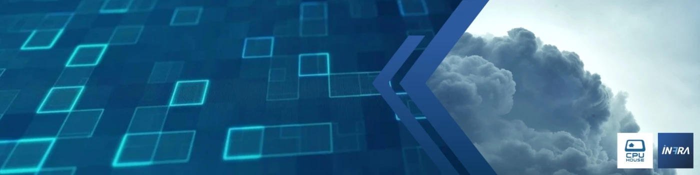

  

***

Hey there,

I'm Christian Tosta, Owner and CIO of Infra7, a company based on Sete Lagoas, Brazil. Sete Lagoas is a city located near Belo Horizonte, capital of estate of Minas Gerais, and
one of most promising cities for IT development in the country.

## Current Stats

|    |
| :---: |

|  |  |
| :---: | :---: |

|  |
| :---: |

